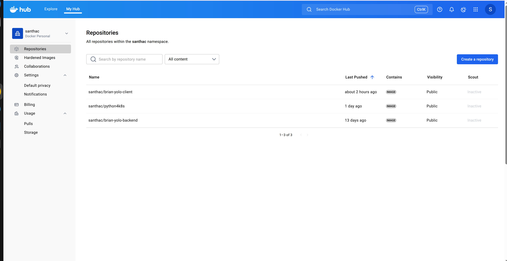
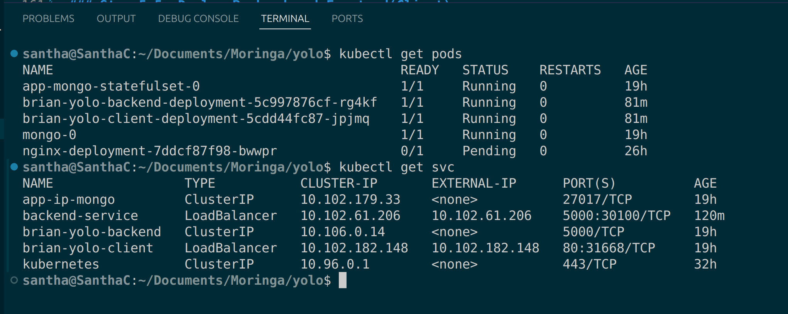

# FULL STACK E-COMMERCE PLATFORM 

## 1. Project Overview

This project focuses on containerizing and orchestrating a full-stack e-commerce application built using Node.js (Backend), React (Frontend) and MongoDB (Database).

In this week’s Independent Project (Week 8 IP4 – Orchestration), the application is deployed on Google Kubernetes Engine (GKE) using multiple Kubernetes objects for high availability, persistence and scalability.

Users can browse, add and manage product data seamlessly — with data persistence ensured even after Pod or Node restarts via PersistentVolumes and a StatefulSet for MongoDB.

## 2. Architecture and Microservices

The system is divided into three microservices connected through a dedicated Kubernetes network and managed by a set of Kubernetes manifests.

(i) brain-yolo-client - React, Node.js - Frontend Dashboard - Host Port 3000

(ii) brian-yolo-backend - Node.js - REST API Server - Internal Port 5000

(iii) app-ip-mongo - MongoDB - Data Storage - Internal Port 27017

## 3. Repository Structure

```
YOLO/
├── .vscode/
│   └── settings.json
├── backend/               #Backend(Node.js)
│   ├── models/
│   │   └── Products.js
│   ├── node_modules/
│   ├── routes/api/        # Defines API endpoints
│   │   └── productRoute.js
│   ├── .gitignore
│   ├── Dockerfile
│   ├── package-lock.json
│   ├── package.json
│   ├── server.js         # Backend entry point
│   └── upload.js         # Login for handling file uploads
├── client/               #Frontend(React)
│   ├── public/
│   │   ├── favicon.ico
│   │   ├── index.html
│   │   ├── logo192.png
│   │   ├── logo512.png
│   │   ├── manifest.json
│   │   └── robots.txt
│   └── src/
│       ├── components/   #Reusable UI components
│       │   ├── AboutUs.js
│       │   ├── AddProduct.js
│       │   ├── App.js
│       │   ├── EditProductForm.js
│       │   ├── Footer.js
│       │   ├── Header.js
│       │   ├── Navbar.js
│       │   ├── NewProductForm.js
│       │   ├── Product.js
│       │   ├── ProductControl.js
│       │   ├── ProductDetail.js
│       │   ├── ProductList.js
│       │   ├── ReusableForm.js
│       │   └── images/
│       │       ├── backgrounds
│       │       ├── logo
│       │       ├── products
│       │       ├── screenshots
│       │       ├── social_icons
│       │       ├── mouse_click.png
│       │       └──product_image.jpeg
│       │   
│       │    
│       ├── App.css
│       ├── App.test.js
│       ├── index.js
│       ├── product-detail.css
│       ├── serviceWorker.js
│       └── setupTests.js
├── .gitignore
├── Dockerfile
├── package-lock.json
├── README.md
└── roles/
    ├── backend-deployment/
    │   ├── tasks/
    │   │   └── main.yml
    │   └── vars/
    │       └── main.yml
    ├── frontend-deployment/
    │   ├── tasks/
    │   │   └── main.yml
    │   └── vars/
    │       └── main.yml
    ├── setup-mongodb/
    │   └── tasks/
    │       └── main.yml
    └── vars/
        ├── main.yml
        ├── .dockerignore
        ├── .gitignore
        ├── ansible.cfg
        ├── backend-deployment.yaml
        ├── docker-compose.yaml
        ├── explanataion.md
        ├── frontend-deployment.yaml
        ├── hosts
        ├── image.png
        ├── inventory.yml
        ├── playbook.yml
        ├── README.md
        ├── Structure
        └── Vagrantfile
```
---

## 4. Prerequisites 

Ensure the following tools are installed and configured:

Docker Engine – for building images

kubectl – for Kubernetes cluster management

Google Cloud SDK (gcloud) – for GKE authentication and deployment

Git – for version control

DockerHub Account – to store tagged images
## 5. Deployment on Google Kubernetes Engine(GKE)


### Step 5.1: Clone the Repository

Navigate to your preferred directory and clone the project:

1. Clone the repo
```bash
 git clone https://github.com/SanthaC/yolo
- cd yolo 
```

### Step 5.2: Create GKE Cluster
#### Step 5.2.1: Make sure you have:
```bash
sudo apt update
sudo apt install -y kubectl google-cloud-sdk

```
#### Step 5.2.2: Login to Google Cloud
```bash
gcloud auth login
gcloud config set project cryptic-ground-477217-i2

```
#### Step 5.2.3: Create a cluster
```bash
gcloud container clusters create yolo-cluster --num-nodes=3
gcloud container clusters get-credentials yolo-cluster

```
### Step 5.3: Build and Push Docker Images
As a project deliverable, the custom-built images for the client and backend services have been successfully pushed to the public DockerHub registry, ensuring they are versioned and universally available for deployment.



The screenshot above confirms the successful push and the use of the required Semantic Versioning (v1.0.0) tag, satisfying the Image Deployment and Image Versioning criteria.
```bash
docker build -t santhac/brian-yolo-client:v1.0.1 .
docker build -t santhac/brian-yolo-backend:v1.0.1 .

docker push santhac/brian-yolo-client:v1.0.1
docker push santhac/brain-yolo-backend:v1.0.0

```
### Step 5.4: Deploy MongoDB Stateful
```bash


```
### Step 5.5: Deploy Backend and Frontend(Client)
```bash
kubectl apply -f frontend-deployment.yaml
kubectl apply -f backend-deployment.yaml

```
### Step 5.6: Verify Deployments
```bash
kubectl get pods
kubectl get svc

```

## 7. Accessing the Application
Run
```bash
kubectl get svc

```
Then access the platform via:
```bash
http://10.102.182.148/

```


## 8. Testing Functionality and Persistence

### Step 8.1: Add Product
Use the "Add Product" form.

Crucially, ensure the "Price" field contains a valid number (e.g. 10.50), as non-numeric input will fail backend validation.

Add the product. It should immediately appear in the list.

### Step 8.2: Validate Persistence
Delete the MongoDB pod:
```bash
kubectl delete pod <mongo-pod-name>

```
Kubernetes recreates the Pod automatically, but data remains intact (thanks to PersistentVolume + StatefulSet).


## 9. Kubernetes Object Summary
(i)Frontend(client) - Deployment + LoadBalanacer service - UI exposure and scaling
(ii)Backend - Deployment + ClusterIP service - REST API login and internal networking
(iii)Database - Stateful + PVC + PV - Persistent data Storage
(iv)Namespace - Namespace Resource isolation

## 10. Semantic Versioning and DockerHub
All images use semantic version tags (v1.0.0) for consistency and traceability.
DockerHub repo:
📦 https://hub.docker.com/repository/docker/santhac

## 11. Troubleshooting and Debugging Measures
Used kubectl logs to inspect backend and MongoDB errors.

Validated service connectivity via kubectl exec -it and curl commands.

Adjusted MongoDB connection strings to use Kubernetes DNS names (mongo-service:27017).

Ensured readiness/liveness probes for backend pods.

## 12. Reference
Kubernetes Documentation – StatefulSets

Google Kubernetes Engine (GKE)

DockerHub Semantic Versioning

✅ 13. Final Deliverables
GitHub Repository: https://github.com/SanthaC/yolo

Live Application: http://10.102.182.148/

Explanation File: explanation.md (includes justification for object choices, exposure method and persistence strategy)