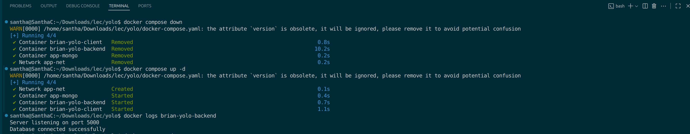
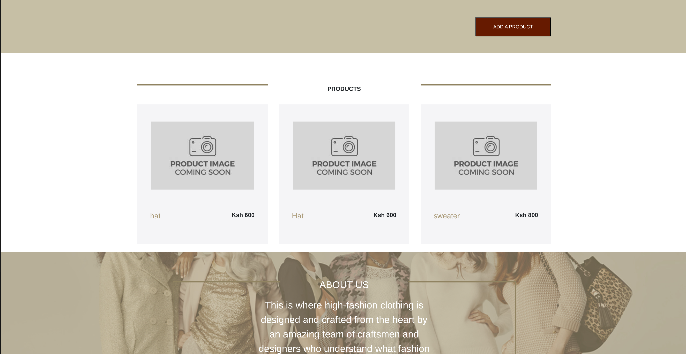

# Configuration Management Independent Project (IP)

This repository contains the solution for the Configuration Management Independent Project, focusing on **Ansible** for configuration management and application deployment, with an optional but implemented **Terraform** component for infrastructure provisioning.

The project deploys a containerized e-commerce web application, leveraging a **Vagrant**-provisioned server for a local development/testing environment.

---

## 🚀 Project Overview

The goal of this assignment was to automate the deployment of a multi-component e-commerce application using configuration management tools. The application consists of a **Web (Frontend(Client))**, **API (Backend)** and a **Databasedb)(Mongo** component, all running as Docker containers.

The project is structured into two main stages:

### Stage 1: Ansible Instrumentation
Automates the provisioning of a Vagrant VM and the complete setup, configuration and deployment of the containerized application using only an **Ansible Playbook**.

### Stage 2: Ansible and Terraform Instrumentation
Introduces **Terraform** for infrastructure provisioning. A main Ansible playbook triggers a Terraform module to provision the Vagrant server and then continues with Ansible roles for server configuration and application deployment, offering a single command to deploy the full stack.

---

## 📂 Repository Structure

The repository is organized to clearly delineate the two stages of the project and adhere to Ansible and Terraform best practices, including the use of roles, variables, and proper file separation.

---

## ⚙️ Deployment Instructions

Follow these steps to deploy the application for both stages.

### Prerequisites

You need the following tools installed on your local machine:

1.  **Vagrant**
2.  **VirtualBox** 
3.  **Ansible** (required for Stage 1 & 2)
4.  **Terraform** (required for Stage 2)
5.  **Git**
---
### Stage 1: Ansible-Only Deployment

#### Step 1: Create and Test the Vagrant Environment

This stage uses the `Vagrantfile` to provision the VM and then runs the `playbook.yml` to configure the server and deploy the application.

1.Bring up the virtual machine:

```bash
vagrant up
`````


2.SSH into it to test:

````bash
vagrant ssh
``````


3. Check if ansible can reach it on host:
`````bash
ansible all -i inventory.yml -m ping
`````
✅ If you get a “pong” response, your setup is correct.


### Step 2: Run your Ansible Playbook

From the host machine, in your project root:
```bash
ansible-playbook -i inventory.yml playbook.yml
``````


This should:

Clone your GitHub code inside the VM.

Build Docker images (for backend, frontend(client), MongoDB).

Run containers via docker-compose.yaml.

Launch your e-commerce site on localhost:port.

Test in your browser ( http://localhost:3000)


### Stage 2: Terraform & Ansible Integration – YOLO E-Commerce App
####🌍 Overview

This stage builds upon Stage 1 by integrating Terraform and Ansible to automate the complete provisioning and configuration of the YOLO e-commerce web application.

The goal is to use Terraform for infrastructure provisioning and Ansible for server configuration and Dockerized application deployment — all triggered with a single command.

#### Folder Structure

⚙️ Key Components

1. Terraform

Provisions a virtual environment (e.g., Vagrant VM or EC2 instance).

Uses variables for configuration management (region, instance type, etc.).

Outputs the instance IP to be used by Ansible.

2. Ansible

Invokes Terraform automatically using the community.general.terraform module.

Installs Docker and creates a shared network app-net.

Deploys three containers:

MongoDB → for data persistence

Backend → API service

Frontend → user interface

### How to Run

1. Navigate to Stage 2 directory
````bash
cd stage_two
````


2. Initialize Terraform
````bash
terraform init
````

3. Run Ansible Playbook
````bash
ansible-playbook -i inventory/hosts.ini playbook.yml
````

This will:

Provision the infrastructure via Terraform

Configure the server

Launch the Dockerized YOLO app automatically

Access the App

http://localhost:3000

#### Roles Summary

Role	Description
setup-mongodb	Pulls and runs MongoDB container, ensuring data persistence.
backend-deployment	Builds or pulls backend API container and connects to MongoDB.
frontend-deployment	Builds or pulls frontend container and connects to backend.

#### Good Practices Implemented

Use of variables for reusability and clarity.

Proper role separation for maintainability.

Tags and blocks used for structured execution.

Terraform–Ansible automation ensures one-step deployment.

#### Expected Outcome

Terraform provisions the server environment.

Ansible configures the environment and runs Docker containers.

The YOLO e-commerce application runs successfully and persists product data.

#### Functionality and Persistence Test (The Core Deliverable)

The successful launch of the application confirms Service Orchestration. Use the following steps to confirm data persistence, a critical objective of this project:

1: Add a Product
Access the dashboard at http://localhost:3000.

Use the "Add Product" form.

Crucially, ensure the "Price" field contains a valid number (e.g. 10.50), as non-numeric input will fail backend validation.

Add the product. It should immediately appear in the list.

2. Confirm Persistence

Stop the entire application stack (this simulates a system shutdown):
```bash
docker compose down
```

This command shuts down the containers but preserves the persistent named volume, app-mongo-data.

Restart the application:
```bash
docker compose up -d
```



Verify Data: Refresh the browser at http://localhost:3000. The product added in Step 5.1 must still be visible. If it is present, data persistence is confirmed via the custom Docker Volume setup.



