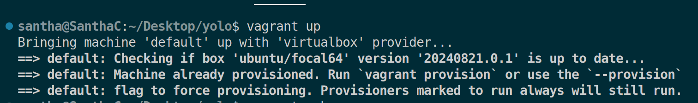
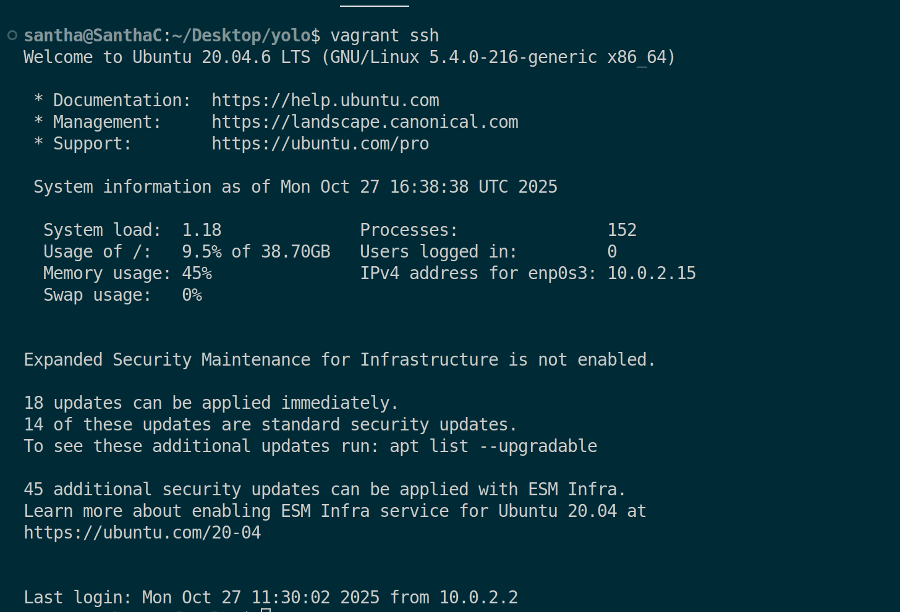
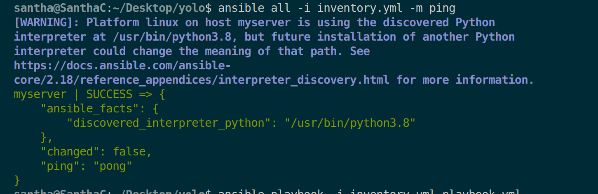
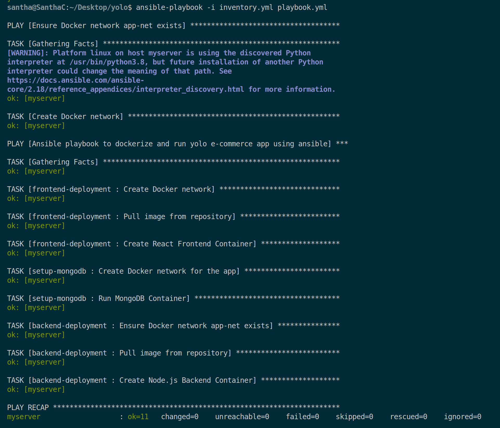
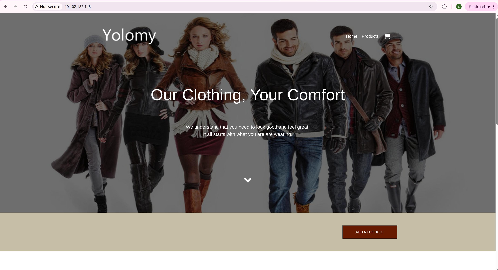

# Configuration Management Independent Project (IP)

This repository contains the solution for the Configuration Management Independent Project, focusing on **Ansible** for configuration management and application deployment, with an optional but implemented **Terraform** component for infrastructure provisioning.

The project deploys a containerized e-commerce web application, leveraging a **Vagrant**-provisioned server for a local development/testing environment.

---

## 🚀 Project Overview

The goal of this assignment was to automate the deployment of a multi-component e-commerce application using configuration management tools. The application consists of a **Web (Frontend(Client))**, **API (Backend)** and a **Databasedb)(Mongo** component, all running as Docker containers.

The project is structured into two main stages:

### Stage 1: Ansible Instrumentation
Automates the provisioning of a Vagrant VM and the complete setup, configuration and deployment of the containerized application using only an **Ansible Playbook**.

### Stage 2: Ansible and Terraform Instrumentation
Introduces **Terraform** for infrastructure provisioning. A main Ansible playbook triggers a Terraform module to provision the Vagrant server and then continues with Ansible roles for server configuration and application deployment, offering a single command to deploy the full stack.

---

## 📂 Repository Structure

The repository is organized to clearly delineate the two stages of the project and adhere to Ansible and Terraform best practices, including the use of roles, variables, and proper file separation.

.
├── ansible.cfg
├── backend
│   ├── Dockerfile
│   ├── models
│   │   └── Products.js
│   ├── package.json
│   ├── package-lock.json
│   ├── routes
│   │   └── api
│   │       └── productRoute.js
│   ├── server.js
│   └── upload.js
├── backend-deployment.yaml
├── client
│   ├── Dockerfile
│   ├── package.json
│   ├── package-lock.json
│   ├── public
│   │   ├── favicon.ico
│   │   ├── index.html
│   │   ├── logo192.png
│   │   ├── logo512.png
│   │   ├── manifest.json
│   │   └── robots.txt
│   ├── README.md
│   └── src
│       ├── App.css
│       ├── App.test.js
│       ├── components
│       │   ├── AboutUs.js
│       │   ├── AddProduct.js
│       │   ├── App.js
│       │   ├── EditProductForm.js
│       │   ├── Footer.js
│       │   ├── Header.js
│       │   ├── Navbar.js
│       │   ├── NewProductForm.js
│       │   ├── ProductControl.js
│       │   ├── ProductDetail.js
│       │   ├── Product.js
│       │   ├── ProductList.js
│       │   └── ReusableForm.js
│       ├── images
│       │   ├── backgrounds
│       │   │   ├── about.jpg
│       │   │   └── hero.jpg
│       │   ├── logo
│       │   │   ├── logo.png
│       │   │   └── shop.png
│       │   ├── mouse_click.png
│       │   ├── product_image.jpeg
│       │   ├── products
│       │   │   ├── backpack.png
│       │   │   ├── giacket.png
│       │   │   ├── pants.png
│       │   │   ├── trekkingshoes.png
│       │   │   ├── tshirt_ladies.png
│       │   │   └── tshirt.png
│       │   ├── screenshots
│       │   │   ├── docker-repo.png
│       │   │   ├── persistent-web-data.png
│       │   │   ├── ping-response.png
│       │   │   ├── playbook.png
│       │   │   ├── successful-container-running.png
│       │   │   ├── successful-docker-login.png
│       │   │   ├── terminal-image.png
│       │   │   ├── vagrant-ssh.png
│       │   │   ├── vagrant-up.png
│       │   │   └── web-application.png
│       │   └── social_icons
│       │       ├── facebook.png
│       │       ├── flickr.png
│       │       ├── g_plus.png
│       │       ├── pinterest.png
│       │       ├── skype.png
│       │       ├── stumble_upon.png
│       │       ├── twitter_bird.png
│       │       ├── twitter.png
│       │       └── you_tube.png
│       ├── index.js
│       ├── product-detail.css
│       ├── serviceWorker.js
│       └── setupTests.js
├── docker-compose.yaml
├── explanation.md
├── frontend-deployment.yaml
├── hosts
├── image.png
├── inventory.yml
├── playbook.yml
├── README.md
├── roles
│   ├── backend-deployment
│   │   ├── tasks
│   │   │   └── main.yml
│   │   └── vars
│   │       └── main.yml
│   ├── frontend-deployment
│   │   ├── tasks
│   │   │   └── main.yml
│   │   └── vars
│   │       └── main.yml
│   └── setup-mongodb
│       ├── tasks
│       │   └── main.yml
│       └── vars
│           └── main.yml
├── Stage_two
│   ├── ansible.cfg
│   ├── inventory.yml
│   ├── playbook.yml
│   └── terraform
│       ├── terraform.tfstate
│       └── terraform.tfstate.backup
├── Structure
└── Vagrantfile

---

## ⚙️ Deployment Instructions

Follow these steps to deploy the application for both stages.

### Prerequisites

You need the following tools installed on your local machine:

1.  **Vagrant**
2.  **VirtualBox** 
3.  **Ansible** (required for Stage 1 & 2)
4.  **Terraform** (required for Stage 2)
5.  **Git**
---
### Stage 1: Ansible-Only Deployment

#### Step 1: Create and Test the Vagrant Environment

This stage uses the `Vagrantfile` to provision the VM and then runs the `playbook.yml` to configure the server and deploy the application.

1.Bring up the virtual machine:

```bash
vagrant up
`````


2.SSH into it to test:

````bash
vagrant ssh
``````


3. Check if ansible can reach it on host:
`````bash
ansible all -i inventory.yml -m ping
`````
✅ If you get a “pong” response, your setup is correct.



### Step 2: Run your Ansible Playbook

From the host machine, in your project root:
```bash
ansible-playbook -i inventory.yml playbook.yml
``````


This should:

Clone your GitHub code inside the VM.

Build Docker images (for backend, frontend(client), MongoDB).

Run containers via docker-compose.yaml.

Launch your e-commerce site on localhost:port.

Test in your browser ( http://localhost:3000)



