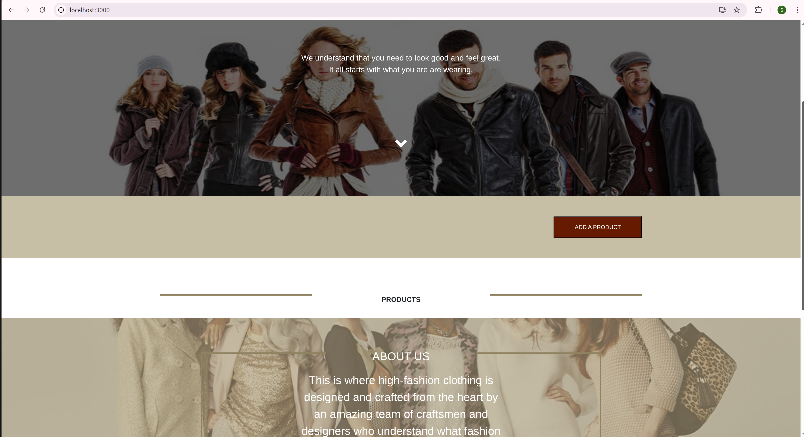

# FULL STACK E-COMMERCE PLATFORM 

## 1. Project Overview

This project focused on containerizing a pre-existing application built with Node.js, React and MongoDB. The final outcome is a fully operational e-commerce platform that enables users to browse, add, and maintain product data, even after containers are stopped or restarted.
The entire environment is launched via a single docker compose command, ensuring maximum portability and ease of deployment.

## 2. Architecture and Microservices

The application is broken down into three distinct microservices, all connected via a dedicated Docker bridge network (app-net):

(i) brain-yolo-client - React, Node.js - Frontend Dashboard - Host Port 3000

(ii) brian-yolo-backend - Node.js - REST API Server - Internal Port 5000

(iii) app-ip-mongo - MongoDB - Data Storage - Internal Port 27017

## 3. Requirement 

- To successfully build and run this application, you must have the following software installed on your host machine:

- Docker Engine: For building and running containers.
```bash
- Install Docker Engine
```
- Git: For cloning the repository.

## 4. Deployment and Launch

Follow these steps to clone the repository, build the images and launch the entire application stack:

### Step 4.1: Clone the Repository

Navigate to your preferred directory and clone the project:

1. Clone the repo
```bash
 git clone https://github.com/SanthaC/yolo
- cd yolo 
```
### Step 4.2: Build and Run Containers (Using Docker Compose)

The docker-compose.yaml file defines the build instructions, service dependencies, networking and volume setup.

Execute the following command from the project root directory. The -d flag runs the containers in detached mode:
```bash
docker compose up --build -d
```
Allow 1-2 minutes for the initial images to build and the MongoDB service to initialize.

### Step 4.3: Verify Container Status

After running the command above, use docker ps to confirm that all three microservices are up and running:
```bash
docker ps
```
You should see all three containers (client, backend and mongo) listed with a STATUS of Up.


### Step 4.4: Access the Application

Once the containers are running, the e-commerce dashboard will be available at:

http://localhost:3000



## 5. Functionality and Persistence Test (The Core Deliverable)

The successful launch of the application confirms Service Orchestration. Use the following steps to confirm data persistence, a critical objective of this project:

### Test 5.1: Add a Product
Access the dashboard at http://localhost:3000.

Use the "Add Product" form.

Crucially, ensure the "Price" field contains a valid number (e.g. 10.50), as non-numeric input will fail backend validation.

Add the product. It should immediately appear in the list.

### Test 5.2: Confirm Persistence

Stop the entire application stack (this simulates a system shutdown):
```bash
docker compose down
```

This command shuts down the containers but preserves the persistent named volume, app-mongo-data.

Restart the application:
```bash
docker compose up -d
```


Verify Data: Refresh the browser at http://localhost:3000. The product added in Step 5.1 must still be visible. If it is present, data persistence is confirmed via the custom Docker Volume setup.


## 6. Docker Image Deployment Status

As a final project deliverable, the custom-built images for the client and backend services have been successfully pushed to the public DockerHub registry, ensuring they are versioned and universally available for deployment.


The screenshot above confirms the successful push and the use of the required Semantic Versioning (v1.0.0) tag, satisfying the Image Deployment and Image Versioning criteria.

## 7. Technical Deep Dive

For an in-depth explanation of image choices, network setup using a custom bridge, persistent volume configuration and the troubleshooting process for resolving environment-related issues, please consult the project documentation:

explanation.md (located in the repository root).